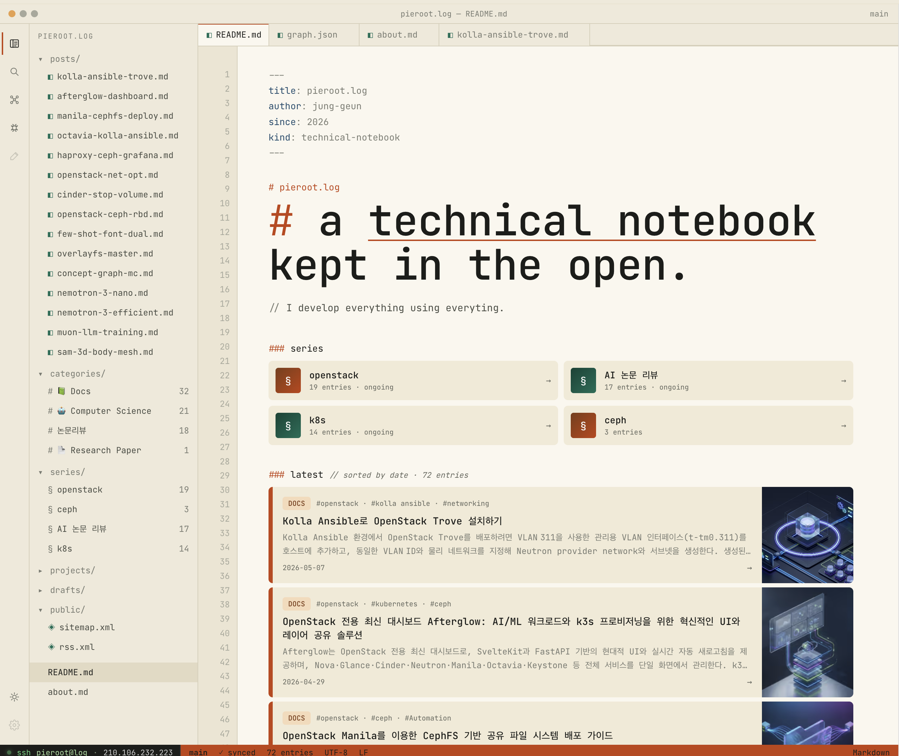
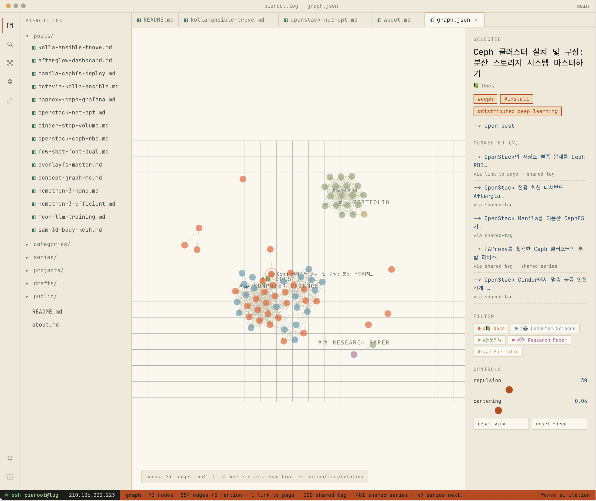
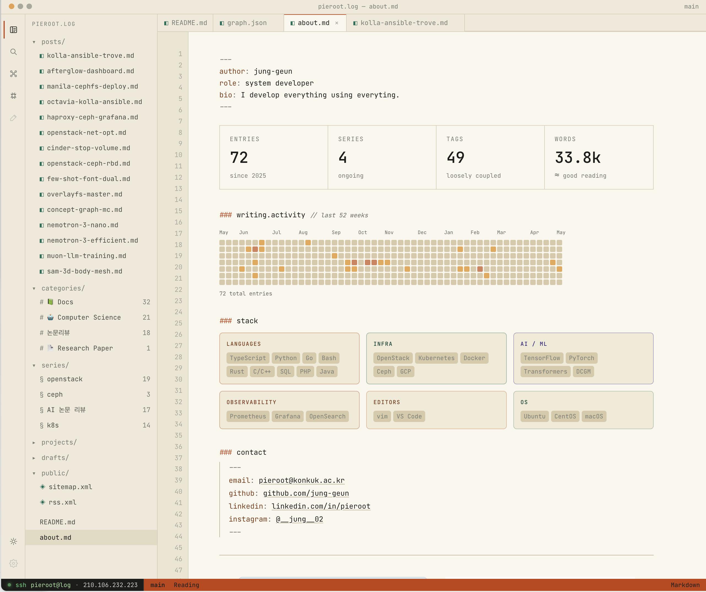

# monolog

> Notion을 CMS로 쓰는 IDE 스타일 기술 노트북.

**[blog.pieroot.xyz](https://blog.pieroot.xyz)** · `v1.13.1` · 셋업 가이드 → [`docs/USAGE.md`](docs/USAGE.md) · 기능 상세 → [`docs/FEATURES.md`](docs/FEATURES.md)

[morethan-log](https://github.com/morethanmin/morethan-log)에서 출발했지만 UI · 라우트 · 데이터 계층을 거의 새로 짠 별개의 작업입니다. 화면 전체가 VS Code 에디터처럼 동작하고, 모든 페이지 이동은 SPA 전환으로 탭이 유지됩니다.

---







---

## 이 프로젝트만의 특징

### Editor chrome — 모든 라우트가 IDE
TitleBar · ActivityBar · FileTree · TabBar · StatusBar · LineNumberGutter가 전 라우트에 일관되게 깔립니다. 글 하나를 읽는 경험이 IDE에서 파일을 여는 경험과 같습니다. 각 라우트는 `useRegisterChrome(filename, statusItems)`로 자기 메타를 동적 등록합니다.

### `⌘K` 커맨드 팔레트 + 다중 탭
`⌘K` 하나로 Actions · Posts · Tags · Categories를 검색해 어디든 점프합니다. 글은 탭으로 열리고 `⌘+Shift+W`로 닫힙니다. 탭 간 전환은 항상 새로고침 없는 SPA 이동 — FileTree · 본문 내 링크 모두 `router.push`로 처리됩니다.

### 옵시디언 스타일 force-directed 그래프
d3-force 시뮬레이션으로 글들이 연결 강도에 따라 자연스럽게 응집·분산됩니다. 엣지는 `mention` · `link` · `link_to_page` · `shared-tag` · `shared-series` · `series-next` 6가지 종류를 지원합니다.

- **노드 드래그** — 잡으면 따라오고 놓으면 시뮬레이션이 자연스럽게 재배치
- **줌/팬** — 휠 줌(0.3x~4x) + 빈 영역 드래그 팬 + 모바일 핀치 줌
- **실시간 force 슬라이더** — repulsion · centering을 슬라이더로 조절. 시뮬레이션을 재생성하지 않고 파라미터만 mutation해 노드 위치 보존
- **그래프 캐시** — `sha1(sorted pageId:lastEditedTime)` 해시 키. 어떤 페이지든 수정되면 자동 재빌드. `next start` 후 `instrumentation.ts`가 백그라운드로 워밍.

### 안정 Notion 이미지 프록시 + 1GB LRU 디스크 캐시
S3 presigned URL이 ISR마다 만료돼도 프록시 URL(`?id=<uuid>&kind=s3`)은 고정 — 브라우저 캐시와 `next/Image` 옵티마이저가 정상 동작합니다. 401/403/410 응답 시 URL 자동 재발급, in-flight dedup으로 동일 이미지 중복 페치 차단.

### 자기 데이터 익명 댓글
외부 SaaS 없이 방문자 댓글을 본인 Notion `comments` DB에 직접 적재합니다. `SHA-256(slug + ipHash + salt)` 앞 4자로 자동 닉네임 생성, honeypot + IP rate limit 스팸 방어, Notion `Status` 필드 하나로 모더레이션.

### Cold start 없는 ISR 워밍
Docker entrypoint가 `next start` 후 자동으로 `/api/init`을 호출해 포스트 캐시를 미리 채웁니다. 그래프는 `instrumentation.ts`가 별도 워밍. 첫 사용자 요청 때 빈 화면이 없습니다.

---

## 스택

| 분류 | 기술 |
|---|---|
| Framework | Next.js 16 (Pages Router, `output: standalone`) |
| Language | TypeScript 6 strict |
| UI | React 19 · Emotion (CSS-in-JS) · Tailwind 3 |
| Data | TanStack Query v5 · `@notionhq/client` v5 · `react-notion-x` 7.x |
| Graph | d3-force · d3-drag · d3-zoom · d3-selection |
| Color | Radix Colors 2 (custom palette) |
| Test | Jest 30 + @swc/jest |
| Container | Docker multi-arch (`linux/amd64`, `linux/arm64`), GHCR |

---

## 시작하기

```bash
git clone https://github.com/jung-geun/monolog.git
cd monolog
pnpm install                 # or: npm install
cp .env.example .env         # NOTION_TOKEN · NOTION_DATASOURCE_ID 필수
pnpm dev                     # or: npm run dev
```

Notion DB는 [**monolog blog assets**](https://www.notion.so/pieroot/blog-assets-35a067c015d080a0bf17d3a0dffb3784) 페이지를 본인 워크스페이스로 **Duplicate** 해서 사용합니다. 전체 셋업 가이드(환경 변수 · Notion 스키마 · Docker · API 엔드포인트)는 [`docs/USAGE.md`](docs/USAGE.md)를 참고하세요.

---

## License

[MIT](LICENSE) — 원본 [morethan-log](https://github.com/morethanmin/morethan-log)의 라이선스를 따릅니다.
