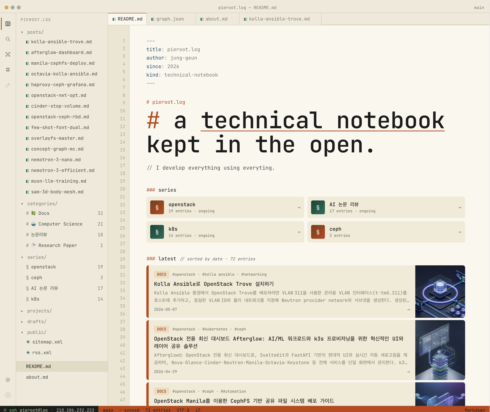
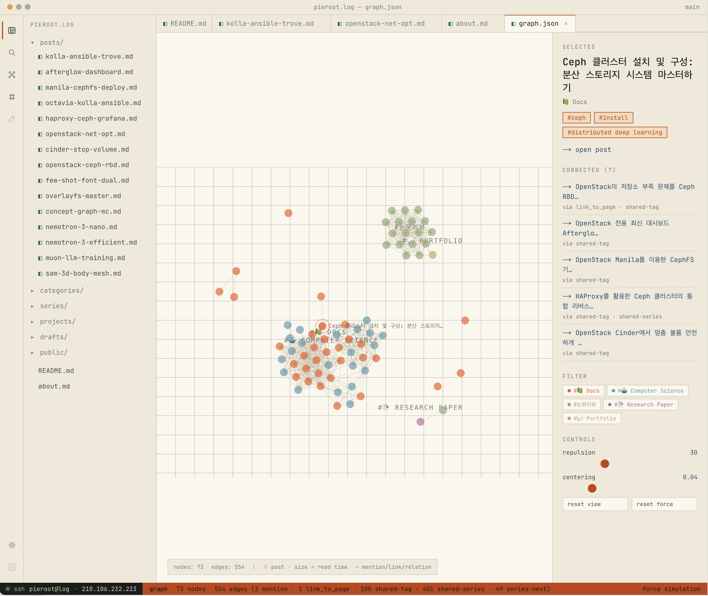
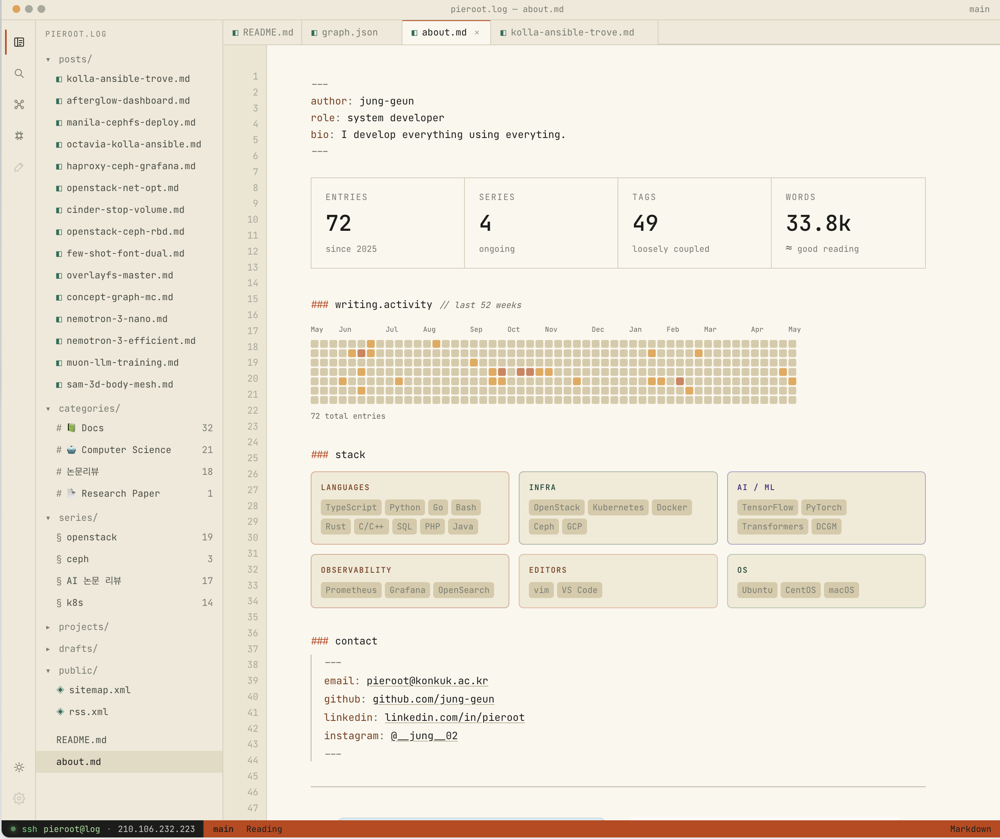

# monolog

> Notion을 CMS로 쓰는 IDE 스타일 기술 노트북.

**[blog.pieroot.xyz](https://blog.pieroot.xyz)** · `v1.14.0` · 셋업 가이드 → [`docs/USAGE.md`](docs/USAGE.md) · 기능 상세 → [`docs/FEATURES.md`](docs/FEATURES.md)

[morethan-log](https://github.com/morethanmin/morethan-log)에서 출발했지만 UI · 라우트 · 데이터 계층을 거의 새로 짠 별개의 작업입니다. 화면 전체가 VS Code 에디터처럼 동작하고, 모든 페이지 이동은 SPA 전환으로 탭이 유지됩니다.

---







---

## 이 프로젝트만의 특징

### Editor chrome — 모든 라우트가 IDE
TitleBar · ActivityBar · FileTree · TabBar · StatusBar · LineNumberGutter가 전 라우트에 일관되게 깔립니다. 글 하나를 읽는 경험이 IDE에서 파일을 여는 경험과 같습니다. 각 라우트는 `useRegisterChrome(filename, statusItems, kind)`로 자기 메타와 탭 종류를 동적 등록합니다.

### `⌘K` 커맨드 팔레트 + 다중 탭
`⌘K` 하나로 Actions · Posts · Tags · Categories를 검색해 어디든 점프합니다. 글 탭은 `Alt/Option+W`로 닫고 `Alt/Option+Shift+T`로 다시 열 수 있습니다. 브라우저가 `Cmd/Ctrl+W`·`Cmd/Ctrl+Shift+T`를 페이지에 전달할 때만 같은 동작을 처리합니다. 사용자가 동의하면 열린 탭과 최근 닫은 글 주소를 이 브라우저에 저장해 새로고침 후 복원합니다. 탭 간 전환은 항상 새로고침 없는 SPA 이동 — FileTree · 본문 내 링크 모두 `router.push`로 처리됩니다.

`README.md`를 포함한 모든 탭은 마우스로 드래그해 순서를 바꿀 수 있습니다. 드래그 대신 탭바의 좌우 버튼을 클릭하거나 키보드로 실행해 현재 탭을 이동할 수도 있습니다. 순서를 바꿔도 현재 읽는 페이지는 유지되고, 탭 저장에 동의하면 바꾼 순서도 복원합니다.

### Three.js 3D 지식 그래프
Three.js 원근 카메라와 d3-force-3d의 XYZ 시뮬레이션으로 실제 포스트·태그·시리즈 관계를 입체 공간에 배치합니다. 포스트는 구, 태그는 입체 마름모, 시리즈는 와이어프레임 마름모로 구분합니다.

- **회전·이동·줌** — 왼쪽 드래그 회전, 오른쪽 또는 Shift+드래그 이동, 휠 줌. 모바일은 한 손가락 회전과 두 손가락 이동·핀치 줌
- **노드 이동** — Alt/Option+드래그로 노드를 옮기고 놓으면 3D 시뮬레이션이 재배치
- **관계 탐색** — 연결 방향·종류·강도를 색상과 화살표로 표시. 선택한 노드의 직접 연결을 강조하고, 연결만 보기·검색·포커스·본문 인용 근거 제공
- **의미 관계** — 기존 온톨로지의 논리·유사 관계는 점선으로 구별하고 신뢰도·분류 근거를 표시. 데이터가 없으면 비활성화하며 임의 관계를 만들지 않음
- **실시간 조절** — 포스트·허브 척력, 허브 반경·인력, 포스트 연결 거리를 변경해도 카메라·노드 상태를 유지. 시간순 재생·일시정지·되감기 지원
- **그래프 캐시** — 공개 글의 본문 해시와 메타데이터로 변경을 감지하고, 기존 Qdrant 스냅샷을 재사용합니다. 콘텐츠 동기화의 대기 작업을 `/api/cron/content`가 증분 갱신하며 `yarn warm:graph`로 수동 워밍할 수 있습니다.

### 안정 Notion 이미지 프록시 + 1GB LRU 디스크 캐시
S3 presigned URL이 ISR마다 만료돼도 프록시 URL(`?id=<uuid>&kind=s3`)은 고정 — 브라우저 캐시와 `next/Image` 옵티마이저가 정상 동작합니다. 401/403/410 응답 시 URL 자동 재발급, in-flight dedup으로 동일 이미지 중복 페치 차단.

### 자기 데이터 익명 댓글
외부 SaaS 없이 방문자 댓글을 본인 Notion `comments` DB에 직접 적재합니다. `SHA-256(slug + ipHash + salt)` 앞 4자로 자동 닉네임 생성, honeypot + IP rate limit 스팸 방어, Notion `Status` 필드 하나로 모더레이션.

### 증분 콘텐츠 동기화 + Cold start 없는 워밍
Notion webhook과 운영 호스트의 15분 cron 대조가 바뀐 글만 다시 가져오고 영향받는 경로만 재생성합니다. 발행본은 내구성 콘텐츠 레지스트리(AOF Redis)에 저장돼 Notion 장애·재시작 중에도 유지되고, slug 변경은 이전 주소에서 308로 이어집니다. Docker entrypoint는 `next start` 후 `/api/init`으로 레지스트리를 준비하고 모든 공개 경로를 워밍합니다. GitHub Actions schedule은 지연·누락 가능한 보조 트리거입니다.

---

## 스택

| 분류 | 기술 |
|---|---|
| Framework | Next.js 16 (Pages Router, `output: standalone`) |
| Language | TypeScript 6 strict |
| UI | React 19 · Emotion (CSS-in-JS) · Tailwind 3 |
| Data | TanStack Query v5 · `@notionhq/client` v5 · `react-notion-x` 7.x |
| Graph | Three.js · d3-force-3d (3D 뷰) · d3-force (서버·온톨로지) |
| Color | Radix Colors 2 (custom palette) |
| Test | Jest 30 + @swc/jest |
| Container | Docker Compose + GHCR (`linux/amd64` 운영 이미지) |

---

## 시작하기

```bash
git clone https://github.com/jung-geun/monolog.git
cd monolog
yarn install
cp .env.example .env         # NOTION_TOKEN · NOTION_DATASOURCE_ID 필수 (로컬 레지스트리 CONTENT_STATE_DIR 포함)
yarn dev
```

Notion DB는 [**monolog blog assets**](https://www.notion.so/pieroot/blog-assets-35a067c015d080a0bf17d3a0dffb3784) 페이지를 본인 워크스페이스로 **Duplicate** 해서 사용합니다. 전체 셋업 가이드(환경 변수 · Notion 스키마 · Docker · API 엔드포인트)는 [`docs/USAGE.md`](docs/USAGE.md)를 참고하세요.

---

## License

[MIT](LICENSE) — 원본 [morethan-log](https://github.com/morethanmin/morethan-log)의 라이선스를 따릅니다.
